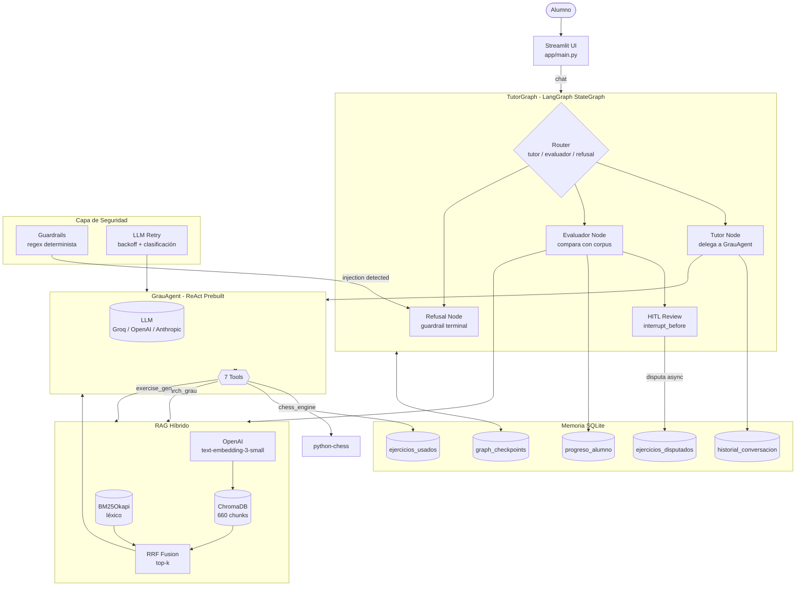
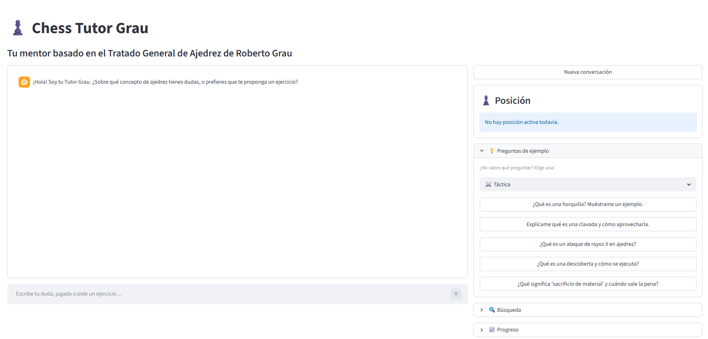
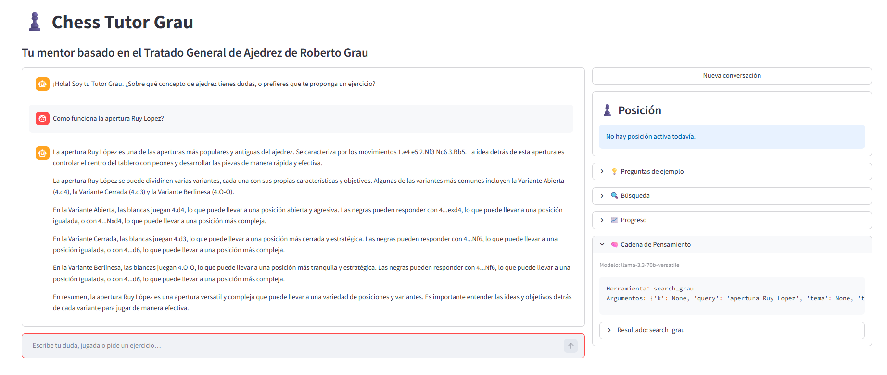
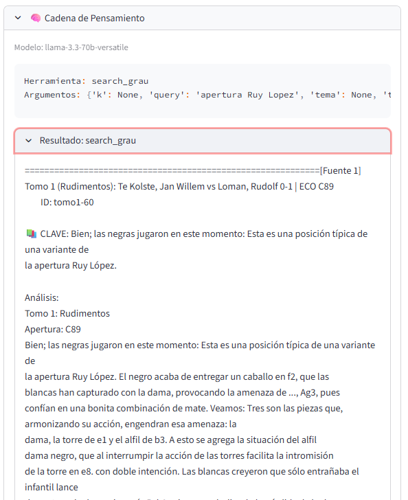
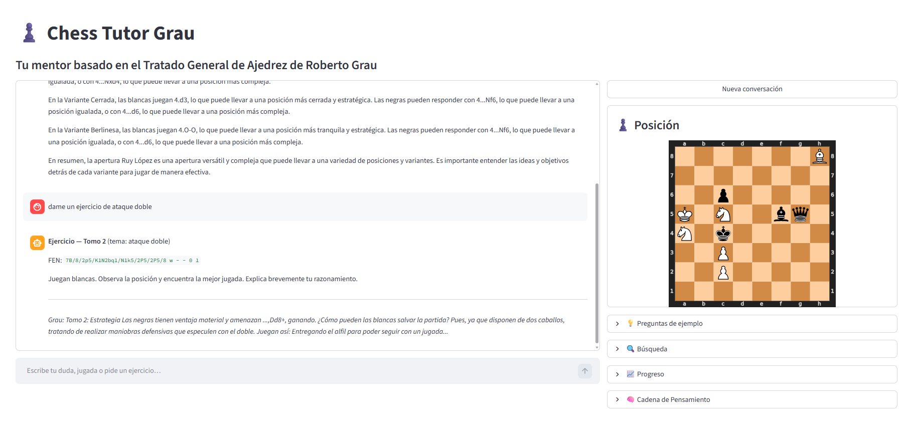
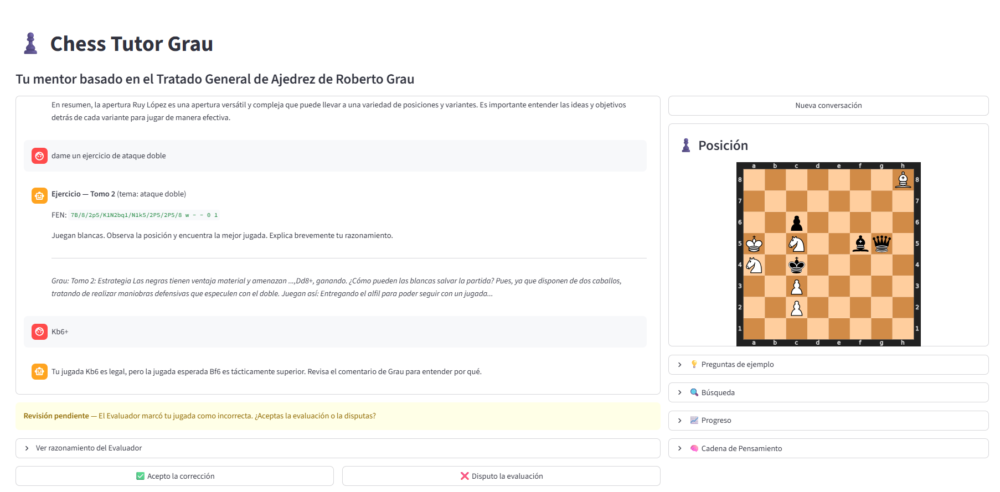

# Chess Tutor Grau

Tutor de ajedrez basado en el **Tratado General de Ajedrez** de Roberto Grau (4 tomos clásicos, ~1940). Usa retrieval híbrido sobre el corpus + un agente ReAct + un grafo multiagente con HITL para enseñar conceptos pedagógicos, comentar partidas históricas y generar ejercicios prácticos sobre posiciones reales.

Proyecto final del Bootcamp **AI Engineer** de Código Facilito.

---

## Arquitectura



### Componentes principales

| Capa | Implementación | Archivo |
|------|----------------|---------|
| **UI** | Streamlit con tablero SVG + panel progreso + cadena de pensamiento | [`app/main.py`](app/main.py) |
| **Grafo** | LangGraph `StateGraph` con 5 nodos (router, tutor, evaluador, hitl_review, refusal) | [`graph/graph.py`](graph/graph.py) |
| **Agente** | LangGraph `create_react_agent` (stateless) con 7 tools + retry automático | [`agents/react_agent.py`](agents/react_agent.py) |
| **RAG** | ChromaDB + BM25 + RRF + filtro por tomo (`where`) | [`rag/retrieval.py`](rag/retrieval.py) |
| **Motor** | python-chess: validación + análisis + heurística de fortaleza táctica | [`agents/tools/chess_engine.py`](agents/tools/chess_engine.py) |
| **Ejercicios** | Generador desde corpus + evaluador con `_move_strength_score` | [`agents/tools/exercise_gen.py`](agents/tools/exercise_gen.py) |
| **Memoria** | SQLite (4 tablas) + LangGraph `SqliteSaver` (1 fuente de verdad) | [`memory/`](memory/) + [`core/checkpointer.py`](core/checkpointer.py) |
| **Guardrails** | Detección de prompt injection (regex determinista) antes del LLM | [`core/guardrails.py`](core/guardrails.py) |
| **LLM Retry** | Clasificación de errores transitorios vs de configuración; retry con backoff | [`core/llm_retry.py`](core/llm_retry.py) |

---

## Quickstart con Docker

### Requisitos

- Docker Desktop
- API keys: `OPENAI_API_KEY` (embeddings) + `GROQ_API_KEY` o `ANTHROPIC_API_KEY` (LLM)

### Pasos

1. Clonar el repo y entrar al directorio:
   ```bash
   git clone <repo-url>
   cd ProjectGrauTutor
   ```

2. Copiar `.env.example` a `.env` y rellenar las API keys:
   ```bash
   cp .env.example .env
   # editar .env con tus keys
   ```

3. Levantar la pila:
   ```bash
   docker compose up --build
   ```

4. Ingestar el corpus (primera vez, en otro terminal):
   ```bash
   docker compose exec app python rag/pipeline.py
   ```

5. Abrir la UI: <http://localhost:8501>

ChromaDB queda persistido en el volumen `chroma-data`. SQLite y BM25 quedan en `./db/`.

---

## Setup local (sin Docker)

```bash
# Python 3.11+
pip install -r requirements.txt

# Levanta solo ChromaDB con Docker
docker compose up chromadb -d

# Crea .env con tus keys (igual que arriba)
cp .env.example .env

# Ingesta del corpus
py rag/pipeline.py

# Levanta la UI
streamlit run app/main.py
```

---

## Variables de entorno

| Variable | Default | Descripción |
|----------|---------|-------------|
| `LLM_PROVIDER` | `groq` | `groq` \| `openai` \| `anthropic` |
| `LLM_MODEL` | `llama-3.3-70b-versatile` | Modelo del provider elegido |
| `OPENAI_API_KEY` | — | **Obligatorio** para embeddings |
| `GROQ_API_KEY` | — | Obligatorio si `LLM_PROVIDER=groq` |
| `ANTHROPIC_API_KEY` | — | Obligatorio si `LLM_PROVIDER=anthropic` |
| `EMBEDDING_MODEL` | `text-embedding-3-small` | Modelo OpenAI de embeddings |
| `CHROMA_HOST` | `localhost` | Host de ChromaDB |
| `CHROMA_PORT` | `8000` | Puerto de ChromaDB |
| `CHROMA_COLLECTION` | `grau_partidas` | Nombre de colección |
| `SQLITE_DB_PATH` | `db/chess_tutor.db` | Ruta del SQLite de memoria |
| `BM25_INDEX_PATH` | `db/bm25.pkl` | Ruta del índice BM25 pickled |
| `LOG_LEVEL` | `INFO` | `DEBUG` \| `INFO` \| `WARNING` |

---

## Ejemplos de uso

### Vista general

Layout en dos columnas: chat a la izquierda; panel lateral con búsqueda configurable, posición activa, progreso del alumno y cadena de pensamiento.



### Pregunta conceptual con grounding sobre el corpus

El alumno pregunta por la apertura Ruy López. El Tutor delega al `GrauAgent`, que invoca `search_grau` y construye la respuesta a partir de los pasajes recuperados del corpus.



### Cadena de pensamiento — herramienta y resultado

Para la misma consulta, el panel "Cadena de Pensamiento" muestra la herramienta llamada (`search_grau`), los argumentos (`query`, `tomo`) y el pasaje recuperado de Grau con su metadata (`Tomo 1`, `ECO C89`, partida `tomo1-60`). Esto demuestra el patrón ReAct con razonamiento visible.



### Ejercicio generado desde el corpus

Al pedir un ejercicio, el grafo entra en flujo Evaluador: recupera una posición real del corpus (Tomo 3, tema "sobrecarga de piezas"), arma el ejercicio con FEN y comentario pedagógico, y renderiza el tablero SVG en el panel lateral.



### Evaluación de la respuesta del alumno

El alumno responde con su jugada (`a6+`). El Evaluador valida con `python-chess`, compara contra la jugada esperada de Grau, da retroalimentación y actualiza el progreso (40 consultas, 6 ejercicios, 17% aciertos visibles en el panel).



---

## Evaluación

El sistema tiene **3 evaluaciones independientes** que cubren retrieval, faithfulness del agente y precisión del motor de ejercicios.

| Eval | Qué mide | Métrica clave | Reporte |
|------|----------|---------------|---------|
| **Retrieval** | A/B dense-only vs híbrido sobre 25 queries | Hit@5 = **80%** (hybrid) | [`evals/EVAL_REPORT.md`](evals/EVAL_REPORT.md) |
| **Faithfulness** | El agente usa el corpus y cita fuente | Groundedness = **100%**, citation = 69% | [`evals/FAITHFULNESS_REPORT.md`](evals/FAITHFULNESS_REPORT.md) |
| **Ejercicios** | Generador + evaluador de jugadas | Precisión = **100%** (correctas / ilegales) | [`evals/EXERCISES_REPORT.md`](evals/EXERCISES_REPORT.md) |

### Cómo correrlas

```bash
# Retrieval (necesita ChromaDB corriendo)
py evals/runner.py

# Faithfulness (necesita ChromaDB + OPENAI_API_KEY; usa gpt-4o-mini)
py evals/faithfulness_runner.py

# Ejercicios (solo necesita ChromaDB)
py evals/exercises_runner.py
```

Resultados detallados se guardan en `evals/*_results.json`.

---

## Estructura del proyecto

```
ProjectGrauTutor/
├── app/                  # UI Streamlit
│   ├── main.py
│   └── components/       # board, progress
├── agents/               # GrauAgent (ReAct) + 7 tools
│   ├── react_agent.py
│   └── tools/            # search_grau, chess_engine, exercise_gen
├── graph/                # LangGraph StateGraph (router, tutor, evaluador, hitl)
│   ├── graph.py
│   ├── nodes.py
│   └── state.py
├── rag/                  # ChromaDB + BM25 + RRF
│   ├── retrieval.py
│   ├── ingest.py
│   ├── pipeline.py       # script de ingesta y rebuild de BM25
│   ├── store.py
│   ├── bm25.py
│   └── embeddings.py
├── memory/               # SQLite (progreso, historial, ejercicios)
│   ├── database.py
│   ├── progress.py
│   ├── history.py
│   └── exercises.py
├── core/                 # Config, logging, LLM factory, checkpointer, guardrails, retry
├── contracts/            # Pydantic models (PartidaGrau, ChunkMetadata, Progreso)
├── evals/                # 3 datasets + 3 runners + 3 reports
├── tests/                # Pytest (127 tests, 6 suites)
├── data/                 # 4 PGN de Grau
├── deploy/Dockerfile
├── docker-compose.yml
└── requirements.txt
```

---

## Decisiones de arquitectura clave

### Una sola fuente de verdad para el estado

El proyecto tuvo inicialmente dos checkpointers (uno en el agente, otro en el grafo), lo que causaba bugs de sincronización (current_fen, expected_move). Tras la auditoría, se refactorizó a:

- **GrauAgent stateless** (sin checkpointer propio)
- **TutorGraph única fuente de verdad** (SqliteSaver persistente en `db/graph_checkpoints.db`)
- La historia de conversación se pasa explícitamente al agente como `state["messages"]`

Documentado en el commit `ef3a8d9` ("fix: Auditoría y corrección de 6 debilidades del sistema agéntico").

### Retrieval híbrido por defecto

Ver [`evals/EVAL_REPORT.md`](evals/EVAL_REPORT.md). Hit@5 sube de 72% (dense puro) a 80% (híbrido). El BM25 captura términos técnicos poco frecuentes ("oposición", "gambito de dama") que el embedding no rankea bien.

### HITL como revisión asíncrona

Las disputas del alumno (`Disputo la evaluación`) NO conceden puntos automáticamente. Se guardan en la tabla `ejercicios_disputados` para revisión humana posterior. Esto evita que el alumno aprenda a "disputar siempre" para inflar su progreso.

### Guardrails antes del LLM, no después

La detección de prompt injection usa regex determinista en `core/guardrails.py` ejecutada en el router **antes** de invocar al LLM. Esto bloquea ataques de manipulación de system prompt sin coste de inferencia y sin riesgo de que el modelo sea persuadido por el ataque. El scope temático (ajedrez vs off-topic) sí lo decide el LLM, porque requiere semántica que el regex no puede capturar.

### Retry solo para errores transitorios

`core/llm_retry.py` clasifica excepciones de cualquier provider (Groq, OpenAI, Anthropic) en transitorias (rate limit, timeout, JSON malformado) vs de configuración (modelo no encontrado, API key inválida). Solo las transitorias se reintentan con backoff exponencial. Esto evita reintentos infinitos ante errores que el usuario debe corregir en `.env`.

---

## Limitaciones conocidas

- **Cita débil del corpus:** el agente cita "Grau / Tratado General" en 69% de respuestas, pero solo cita el tomo específico ("Tomo 2", "ECO B22") en 23%. Mitigable con prompt engineering más estricto. Detalle: [`evals/FAITHFULNESS_REPORT.md`](evals/FAITHFULNESS_REPORT.md).
- **Aperturas modernas subrepresentadas:** el corpus es ajedrez clásico hipermoderno (1900-1940). La defensa siciliana solo aparece en 5 chunks; queries sobre aperturas postclásicas tienen Hit@5 = 67%.
- **`alternativa_valida` es heurística, no Stockfish:** distingue mate > jaque > captura > neutral, pero no detecta diferencias posicionales finas. Suficiente para un MVP pedagógico.
- **Tool calling con Groq llama-3.3:** el modelo a veces produce JSON malformado en tool calls (~85% de fallos en faithfulness eval). El sistema funciona bien con OpenAI gpt-4o-mini o Anthropic claude-sonnet.

---

## Roadmap

- [x] Guardrails de prompt injection (regex determinista pre-LLM)
- [x] LLM retry con clasificación transitorio vs configuración
- [x] Nodo `refusal` terminal en el grafo
- [ ] Citation enforcement post-hoc en el grafo (regenerar respuestas sin cita estricta)
- [ ] Integrar Stockfish opcional para evaluación táctica precisa
- [ ] Tutor revisor para procesar disputas asíncronas
- [ ] CI/CD con validación automática de sincronización BM25-ChromaDB

---

## Licencia

Proyecto académico. Los 4 PGN de Grau son obras del dominio público en su jurisdicción de origen (Argentina, fallecido 1944).
